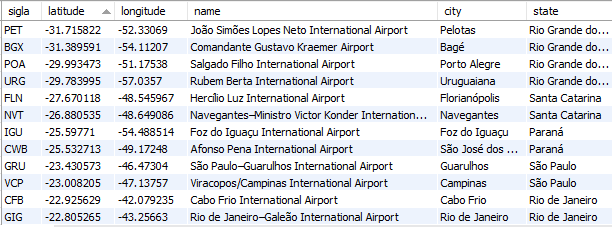
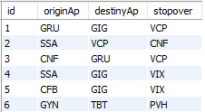

# AirPorts-Java-Classwork

## Resumo do Projeto

---

Aplicação escrita em Java que calcula a menor rota entre dois aeroportos internacionais do Brasil que contenha pelo menos uma escala. Para isso foram utilizados o algoritmo de Dijkstra e um Banco de dados MySql.

## Estrutura do programa

---

O projeto foi dividido em dois **packages:** Principal e Dijkstra . 

O segundo engloba as classes criadas especificamente para a implementação do algoritmo de Dijkstra, enquanto o primeiro contém as classes restantes que foram utilizadas no programa, como a interface com o usuário e o acesso ao banco de dados da aplicação.

### 1. Principal

---

#### 1.1) Principal

Classe que contém a função `main()` da aplicação. Nela é chamado o método `getAirportsData()` para obter uma *ArrayList<Airport>* com os dados dos aeroportos internacionais brasileiros. Em seguida é instanciado um objeto da classe **Menu** que realizará a interface com o usuário. Por último é chamado o método `showMenu()` desse objeto para iniciar a interação.

```java
public class Principal {

    public static void main(String[] args) throws Exception {

        ArrayList<Airport> airportsList = new ArrayList<Airport>();

        // Store the data collected from a csv file inside an ArrayList
        airportsList = Database.getAirportsData();

        // Create a menu with the airport data provided
        Menu mainMenu = new Menu(airportsList);

        // Starts the menu for the user
        mainMenu.showMenu();

    }
}
```

#### 1.2) Airport

Classe que define a estrutura de um aeroporto para a aplicação. 

- **Atributos:**
    - **code:** string de 3 letras que representa o código do aeroporto;
    - **name: ****string que representa o nome do aeroporto;
    - **city:** string que representa a cidade em que se encontra o aeroporto;
    - **state:** string que representa o estado em que se encontra o aeroporto.
- **Métodos:**
    - **Airport:** construtor da classe;
    - **getDirectDistanceBetween:** calcula e retorna a distância direta entre o aeroporto representado pelo próprio objeto e o aeroporto inserido como parâmetro;
    - **getCode:** retorna o código do aeroporto;
    - **getName:** retorna o nome do aeroporto;
    - **getCity:** retorna a cidade do aeroporto;
    - **getState:** retorna o estado do aeroporto;
    - **getLatit:** retorna a latitude do aeroporto;
    - **getLongit:** retorna a longitude do aeroporto.
    ****

```java
public class Airport {

// ATTRIBUTES
    String code, name, city, state;
    Double latit, longit;

// METHODS
    // Constructor
    public Airport(String code, String name, String city, 
										String state, Double latit, Double longit) {
        this.code = code;
        this.name = name;
        this.city = city;
        this.state = state;
        this.latit = latit;
        this.longit = longit;
    }
    
    // Get the direct distance between two airports
    public Double getDirectDistanceBetween(Airport apFinal) {
        double lon1 = Math.toRadians(longit);
        double lon2 = Math.toRadians(apFinal.getLongit());
        double lat1 = Math.toRadians(latit);
        double lat2 = Math.toRadians(apFinal.getLatit());

        double dlon = lon2 - lon1;
        double dlat = lat2 - lat1;

        double a = Math.pow(Math.sin(dlat / 2), 2) + Math.cos(lat1) * Math.cos(lat2) * Math.pow(Math.sin(dlon / 2),2);
        double c = 2 * Math.asin(Math.sqrt(a));
        double r = 6371;

        return(c * r);
    }

    // Getters
    public String getCode() { return code; }
    public String getName() { return name; }
    public String getCity() { return city; }
    public String getState() { return state; }
    public Double getLatit() { return latit; }
    public Double getLongit() { return longit; }
}
```

#### 1.3) Menu

- **Atributos:**
    - **airportsList:** *ArrayList<Airport>* contendo os objetos referentes a todos os aeroportos internacionais do Brasil;
    - **originCode:** *String* contendo o código de 3 letras do aeroporto de origem;
    - **destinyCode:** *String* contendo o código de 3 letras do aeroporto de destino;
    - **statesList:** *Hashset<String>* que será preenchido com o nome de todos os estados com aeroportos internacionais;
    - **citiesList:** *Hashset<String>* que será preenchido com o nome de todos os municípios do estado selecionado pelo usuário e que tenham algum areporto internacional.
- **Métodos:**
    - **Menu:** construtor da classe
    - **showMenu:** inicia a interação com o usuário, chamando os métodos para que ele possa selecionar o aeroporto de destino e depois o aeroporto de origem.
    - **selectDestiny:** apresenta ao usuário duas opções: inserir o código do aeroporto de destino, ou chama um método para listar os códigos dos aeroportos internacionais do Brasil. Por último atualiza o atributo **destinyCode** com o valor inserido;
    - **selectOrigin:** apresenta ao usuário duas opções: inserir o código do aeroporto de origem, ou chama um método para listar os códigos dos aeroportos internacionais do Brasil. Além disso, chama uma função para verificar a validade do código inserido pelo usuário. Por último atualiza o atributo **originCode** com o valor inserido;
    - **printShortestPath:** cria um grafo de nós relacionados a cada aeroporto internacional e chama o método que roda o algoritmo de Dijkstra para descobrir o menor trajeto com pelo menos uma escala dado um aeroporto de origem e um de destino. Após imprimir o trajeto calculado e a sua distância total, um método para armazenar a consulta/resultado no banco de dados é chamado;
    - **insertApCode:** solicita ao usuário para inserir um código de aeroporto e além disso, chama uma função para verificar a validade do código inserido pelo usuário;
    - **listApCodes:** permite que o usuário selecione um estado e um município desse estado para então imprimir uma lista dos códigos dos aeroportos internacionais desse município;
    - **verifyCode:** verifica se um determinado código existe na ArrayList contendo os dados dos aeroportos;
    - **verifyState:** verifica se um determinado estado existe na ArrayList contendo os dados dos aeroportos;
    - **verifyCity:** verifica se um determinado município existe na ArrayList contendo os dados dos aeroportos.

```java
public class Menu {

// ATTRIBUTES
  
  ArrayList<Airport> airportsList;
  String originCode, destinyCode;
  HashSet<String> statesList;
  HashSet<String> citiesList;

// METHODS
  // Constructor
  public Menu(ArrayList<Airport> apList) {
    airportsList = new ArrayList<Airport>(apList);
    statesList = new HashSet<>();
    citiesList = new HashSet<>();
  }
  
  // Starts the menu for the user
  public void showMenu() {        
    System.out.println("--------- ROTAS ÁREAS ---------\n");
    selectDestiny();
    selectOrigin();
    printShortestPath();
    }
    
  // Select the destiny Airport's code
  private void selectDestiny() {
    Scanner obj = new Scanner(System.in);
    
    System.out.println("Seleção do Destino:");
    System.out.println("1. Inserir código do Aeroporto de destino");
    System.out.println("2. Listar códigos dos Aeroportos");
    System.out.print("Escolha uma opção: ");

    try {
      Integer option = obj.nextInt();
      switch(option) {
        case 1:
          destinyCode = insertApCode();
          if(destinyCode == null)
            selectDestiny();
          break;
        case 2:
          listApCodes();
          selectDestiny();
          break;
        default:
          System.out.println("\nOpção inválida!\n");
          showMenu();
      }
    }
    catch(Exception e) {
      System.out.println("Opção inválida!\n");
      selectDestiny();
    }
    
  }

  // Select the origin Airport's code
  private void selectOrigin() {
    Scanner obj = new Scanner(System.in);

    System.out.println("Seleção da Origem:");
    System.out.println("1. Inserir código do Aeroporto de origem");
    System.out.println("2. Listar códigos dos Aeroportos");
    System.out.print("Escolha uma opção: ");

    try {
      Integer option = obj.nextInt();
      switch(option) {
        case 1:
          originCode = insertApCode();
          if(originCode == null)
            selectOrigin();
          break;
        case 2:
          listApCodes();
          selectOrigin();
          break;
        default:
          System.out.println("\nOpção inválida!\n");
          showMenu();
      }
    }
    catch(Exception e) {
      System.out.println("Opção inválida!\n");
      selectOrigin();
    }
  }
  
  // Print the result obtained through the Dijkstra algorithm
  private void printShortestPath() {
    Graph airportsGraph =new Graph(airportsList);
    Node destinyNode = DijkstraAlgorithm.calculateShortestPathFromSource(airportsGraph, originCode, destinyCode);
    String stopoverCode = destinyNode.getShortestPath().get(1).getAirport().getCode();
    Scanner sc = new Scanner(System.in);

    Database.insertRouteOnDB(originCode,destinyCode,stopoverCode);

    System.out.printf("\nTrecho %s -> %s\n", originCode, destinyCode);
    System.out.println("---------------------");
    System.out.print("| ");

    for(Node apNode: destinyNode.getShortestPath()) {
          System.out.print(apNode.getAirport().getCode());
          System.out.print(" -> ");
        }

        System.out.println(destinyCode);
        System.out.printf("| %.2f Km\n\n",destinyNode.getDistance());

        System.out.println("Deseja fazer outra consulta?\n1. Sim\n2. Não");
        System.out.print("Escolha uma opção: ");
        try {
          Integer option = sc.nextInt();
          if(option == 1)
            showMenu();
        }
        catch(Exception e) {
          System.out.println("\nOpção inválida!\n");
        }
  }

  // Handle the insertion of a Airport code by the user
  private String insertApCode() {
    Scanner obj = new Scanner(System.in);
    
    System.out.print("Insira o código do Aeroporto: ");
    try {
      String apCode = obj.nextLine();
      if(apCode.length() != 3) {
        System.out.println("O código deve ser composto por 3 letras maiúsculas!");
        return null;
      }
      if(!verifyCode(apCode)) {
        System.out.println("\nNão existe aeroporto internacional brasileiro com esse código!\n");
        return null;
      }
      System.out.println();
      return apCode;
    }
    catch(Exception e) {
      System.out.println("Código inválido!\n" + e);
      return null;
    }
  }

  // List the Airport codes from the city chosen by the user
  private void listApCodes() {
    Scanner sc = new Scanner(System.in);
    System.out.println("\n------ ESTADOS ------");
    for(Airport ap: airportsList) {
      String apState = ap.getState();
      if(!statesList.contains(apState))
      statesList.add(apState);
      System.out.println(apState);
    }
    System.out.print("\nEscolha um dos estados acima: ");
    
    try {
      String stateSelected = sc.nextLine();
      if(!verifyState(stateSelected))
      listApCodes();
      
      System.out.println("\n------ MUNICÍPIOS ------");
      for(Airport ap: airportsList) {
        String apCity = ap.getCity();
        if(!citiesList.contains(apCity) && stateSelected.equals(ap.getState())) {
          citiesList.add(apCity);
          System.out.println(apCity);
        }
      }
      System.out.print("\nEscolha um dos estados acima: ");
      
      try {
        String citySelected = sc.nextLine();
        if(!verifyCity(citySelected))
        listApCodes();
        
        System.out.println("\n------ AEROPORTOS ------");
        for(Airport ap: airportsList) {
          if(citySelected.equals(ap.getCity())) {
            System.out.println(ap.getCode() + "\n");
          }
        }
      }
      catch(Exception e) {
        System.out.println("Município inválido!\n");
        listApCodes();
      }
    }
    catch(Exception e) {
      System.out.println("Estado inválido!\n");
      listApCodes();
    }
    
  }
  
  // Verify if a Airport Code exists
  private boolean verifyCode(String apCode) {
    for(Airport ap: airportsList) {
      if(apCode.equals(ap.getCode()))
        return true;
    }
    return false;
  }

  // Verify if a State exists
  private boolean verifyState(String apState) {
    if(!statesList.contains(apState)) {
      System.out.println("Estado inválido!\n");
      return false;
    }
    return true;
  }

  // Verify if a City is within a certain State
  private boolean verifyCity(String apCity) {
    if(!citiesList.contains(apCity)) {
      System.out.println("Município inválido!\n");
      return false;
    }
    return true;
  }
  
}
```

#### 1.4) Database

- **Métodos:**
    - **insertRouteOnDB:** insere no banco de dados o resultado do cálculo de menor rota para uma determinada consulta;
    - **getAirportsData:** pega do banco de dados as informações sobre os aeroportos internacionais do Brasil e armazena em uma *ArrayList<Airport>.*

```java
public class Database {

// METHODS
    // Insert the calculated route into the database
    public static void insertRouteOnDB(String originAp, String  destinyAp, String stopover) {
        try {
            Connection connection = DriverManager.getConnection("jdbc:mysql://localhost:3306/airport-project", "root", "MySqlPassCuadros");
            

            String query = "insert into routes (originAp, destinyAp, stopover)" + " values ( ?, ?, ?)";

            PreparedStatement preparedStatement = connection.prepareStatement(query);
            preparedStatement.setString (1, originAp );
            preparedStatement.setString (2, destinyAp);
            preparedStatement.setString (3, stopover);

            preparedStatement.execute();
        }
        catch (Exception e) {
            e.printStackTrace();
        }
    }

    // Get the airports data from the database
    public static ArrayList<Airport> getAirportsData() {
        ArrayList<Airport> airportsList = new ArrayList<>();

        try {
            Connection connection = DriverManager.getConnection("jdbc:mysql://localhost:3306/airport-project", "root", "MySqlPassCuadros");
            Statement statement = connection.createStatement();
    
            ResultSet resultSet = statement.executeQuery("select * from airports");
    
            while(resultSet.next()) {
                String code, name, city, state;
                Double latit, longit;

                code = resultSet.getString("sigla");
                latit = resultSet.getDouble("latitude");
                longit = resultSet.getDouble("longitude");
                name = resultSet.getString("name");
                city = resultSet.getString("city");
                state = resultSet.getString("state");

                Airport ap = new Airport(code, name, city, state, latit, longit);
                airportsList.add(ap);

            }
        }
        catch (Exception e) {
            e.printStackTrace();
        }

        return airportsList;
    }
}
```

### 2. Dijkstra

---

#### 2.1) Node

- **Atributos:**
    - **ap:** objeto da classe **Airport** que contém as informações a respeito do aeroporto relacionado ao nó;
    - **shortestPath:** *LinkedList<Node>* que será preenchido com o percurso de menor distância desde o nó de origem até o nó;
    - **distance:** armazena a distância em quilometros do menor percurso partindo da origem até o nó, inicialmente esse argumento é inicializado com um valor muito grande;
    - **adjacentNodes:** *HashMap<Node,Double>* que será preenchido com um mapa com os nós adjacentes ao nó, relacionando a eles as ditâncias dessas adjacências.
- **Métodos:**
    - **Node:** construtor da classe;
    - **addAdjacentNodes:** adiciona um determinado nó ao *HashMap<Node,Double>* **adjacentNodes**;
    - **removeAdjacentNode:** remove um determinado nó ao *HashMap<Node,Double>* **adjacentNodes**;
    - **getAirport:** retorna o objeto da classe **Airport** referente ao aeroporto do nó;
    - **getShortestPath:** retorna uma *LinkedList<Node>* com o percurso de menor distância até o nó, partindo da origem;
    - **getDistance:** retorna a distância do menor percurso até o nó, partindo da origem;
    - **getAdjacentNodes:** retorna um *HashMap<Node,Double>* com os nós adjacentes ao nó;
    - **setShortestPath:** atualiza o percurso de menor distância até o nó, partindo da origem;
    - **setDistance:** atualiza a distância do percurso de menor distância até o nó, partindo da origem.

```java
public class Node {

// ATTRIBUTES
    private Airport ap;
    private LinkedList<Node> shortestPath = new LinkedList<>();
    private Double distance = Double.MAX_VALUE;
    HashMap<Node, Double> adjacentNodes = new HashMap<>();

// METHODS
    // Constructor
    public Node(Airport ap) {
        this.ap = ap;
    }

    // Add an Adjacent node
    public void addAdjacentNodes(Node destination, Double distance) {
        adjacentNodes.put(destination, distance);
    }
    
    // Remove an Adjacent node
    public void removeAdjacentNode(Node airportNode) {
        this.adjacentNodes.remove(airportNode);
    }

    // Getters
    public Airport getAirport() { return ap; }
    public LinkedList<Node> getShortestPath() { return shortestPath; }
    public Double getDistance() { return distance; }
    public HashMap<Node, Double> getAdjacentNodes() { return adjacentNodes; }

    // Setters
    public void setShortestPath(LinkedList<Node> shortestPath) { this.shortestPath = shortestPath; }
    public void setDistance(Double distance) { this.distance = distance; }
}
```

#### 2.2) Graph

- **Atributos:**
    - **airPortNodes:** um *HashSet<Node>* com os nós que formam o grafo.
- **Métodos:**
    - **Graph:** construtor da classe;
    - **addNode:** adiciona um nó ao grafo, ou seja, adiciona um nós ao *HashSet<Node>* **airPortNodes;**
    - **addAdjacentNodes:** preenche os *HashMap<Node,Double>* **adjacentNodes** de cada nó do pertencente ao grafo, ou seja, adiciona as adjacências entre os nós do grafo;
    - **filterSourceNode:** remove a adjacência entre o nó de origem e o nó de destino escolhido, pois não o que deve ser calculado é a rota mais curto que contém pelo menos uma escala;
    - **getNodeByCode:** retorna um nó do grafo de acordo com um determinado código de aeroporto.

```java
public class Graph {
    
// ATTRIBUTES
    private HashSet<Node> airPortNodes = new HashSet<>();
    
// METHODS
    //Constructor
    public Graph(ArrayList<Airport> airportsList) {
        for(int i=0; i < airportsList.size(); i++) {
            Node aux = new Node(airportsList.get(i));
            addNode(aux);
        }
        addAdjacentNodes();
    }
    
    //Add a node in the airPortNodes HashSet
    private void addNode(Node nodeA) {
        airPortNodes.add(nodeA);
    }
    
    //Add the Adjacent nodes to each Node in the HashSet
    private void addAdjacentNodes() {
      for(Node originNode: airPortNodes) {
        Airport originAp = originNode.getAirport();
        for(Node destinyNode: airPortNodes) {
          if(destinyNode != originNode) {
            Double distance = originAp.getDirectDistanceBetween(destinyNode.getAirport());
            originNode.addAdjacentNodes(destinyNode, distance);
          }
        }
      }
    }
    
    // Remove the Destiny node from the list of Adjacent nodes of the Source node 
    public void filterSourceNode(Node sourceNode, Node destinyNode) {
        for(Node apNode: airPortNodes) {
            if(apNode == sourceNode)
                apNode.removeAdjacentNode(destinyNode);
        }
    }

    //Getters
    public Node getNode(Node requestedNode) {
        for(Node apNode: airPortNodes) {
            if(apNode.getAirport().getCode() == requestedNode.getAirport().getCode())
                return apNode;
        }
        return null;
    }
    public Node getNodeByCode(String code) {
        for(Node apNode: airPortNodes) {
            if(code.equals(apNode.getAirport().getCode()))
                return apNode;
        }
        return null;
    }
    public HashSet<Node> getAirPortNodes() { return airPortNodes; }

}
```

#### 2.3) DijkstraAlgorithm

- **Métodos:**
    - **calculateShortestPathFromSource:** cria dois *HashSet<Node>*, um para os nós não analisados (unsettledNodes) e outro para os nós que foram analisados (settledNodes). Então, ele chama o método **filterSourceNode** para remover a adjacência entre o nó de origem e o nó de destino (para garantirmos ao menos uma escala na rota resultante). Em seguida, é adicionado a unsettledNodes o nó de origem e então se inicia a estrutura de repetição do algoritmo:
        - Remove de unsettledNodes o nó currentNode que possui o atributo **distance** com o menor valor;
        - Para cada nó não pertencente a settledNodes e também adjacente ao currentNode, é verificado através do método **calculateMinimumDistance** se o o percurso contendo currentNode é menor que o percurso até então armazenado no nó em análise. Aí então, adiciona-se cada nó analisado a unsettledNodes.
        - Por último, o currentNode é adicionado a settledNodes.
        
        Ao final da estrutura de repetição é retornado o nó de destino do percurso;
        
    - **getLowestDistanceNode:** retorna o nó que possui o atributo **distance** com o menor valor dentro de unsettledNodes;
    - **calculateMinimumDistance:** verifica se o percurso contendo um determinado nó currentNode é menor que o percurso até então armazenado no nó em análise. Caso seja, os atributos **distance** e **shortestPath** do nó em análise são atualizados para o percurso contendo o currentNode.

```java
public class DijkstraAlgorithm {

//METHODS
    // Calculate the shortest path from the source node for each node in the graph
    public static Node calculateShortestPathFromSource(Graph graph, String originApCode, String destinyApCode) {

        Node originNode = graph.getNodeByCode(originApCode);
        Node destinyNode = graph.getNodeByCode(destinyApCode);

        originNode.setDistance(0.0);
        HashSet<Node> settledNodes = new HashSet<Node>();
        HashSet<Node> unsettledNodes = new HashSet<Node>();
        graph.filterSourceNode(originNode, destinyNode);

        unsettledNodes.add(originNode);

        while (unsettledNodes.size() != 0) {
            Node currentNode = getLowestDistanceNode(unsettledNodes);
            unsettledNodes.remove(currentNode);
            for (Map.Entry< Node, Double> adjacencyPair:
                    currentNode.getAdjacentNodes().entrySet()) {
                Node adjacentNode = adjacencyPair.getKey();
                Double distanceBetween = adjacencyPair.getValue();
                if (!settledNodes.contains(adjacentNode)) {
                    calculateMinimumDistance(adjacentNode, distanceBetween, currentNode);
                    unsettledNodes.add(adjacentNode);
                }
            }
            settledNodes.add(currentNode);
        }
        return destinyNode;
    }

    // Get the node inside the unsettledNodes with the lowest distance from the source node
    private static Node getLowestDistanceNode(HashSet < Node > unsettledNodes) {
        Node lowestDistanceNode = null;
        Double lowestDistance = Double.MAX_VALUE;
        for (Node node: unsettledNodes) {
            Double nodeDistance = node.getDistance();
            if (nodeDistance < lowestDistance) {
                lowestDistance = nodeDistance;
                lowestDistanceNode = node;
            }
        }
        return lowestDistanceNode;
    }

    // Compare a new configuration of path with the current configuration and choose the shortest
    private static void calculateMinimumDistance(Node evaluationNode, Double distanceBetween, Node sourceNode) {
        Double sourceDistance = sourceNode.getDistance();
        if (sourceDistance + distanceBetween < evaluationNode.getDistance()) {
            evaluationNode.setDistance(sourceDistance + distanceBetween);
            LinkedList<Node> shortestPath = new LinkedList<>(sourceNode.getShortestPath());
            shortestPath.add(sourceNode);
            evaluationNode.setShortestPath(shortestPath);
        }
    }
}
```

## Banco de Dados

---

Para esse projeto foi utilizado o Banco de Dados MySql. Nele foram criadas duas tabelas: **airports** e **routes**

### 1. airports

*Tabela com as informações sobre os aeroportos internacionais do Brasil*

---

#### Esquema da relação

**R( sigla:** text**, latitude:** double**, longitude:** double**, name:** text**, city:** text**, state:** text**)** 



### 2. routes

*Tabela com os resultados das consultas realizadas na aplicação*

---

#### Esquema da relação

**R( id:** int**, originAp:** char(3)**, destinyAp:** char(3)**, stopover:** char(3)**)** 

